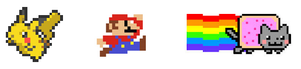
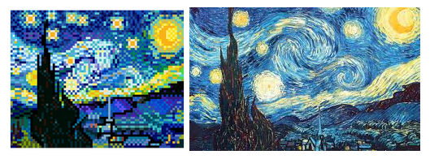
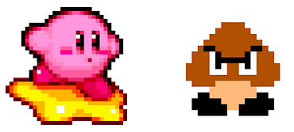

# Project Proposal: Image Mosaic :sunrise: :statue_of_liberty: :mount_fuji: :bridge_at_night:

There are many commercial applications of photo mosaics, such as Picture Mosaics, Mosaically, EasyMoza, etc. Mosaics are a form of art in which a collection of small images called tiles that are arranged in such a way that when they are seen together from a distance they suggest a larger image. Various mosaics can be created for an image depending on the choice of tiles and the restrictions in their placement. Our team aims to develop a system that allows users to take a set of images and base image in order to make an aesthetically pleasing image mosaic.

## Background:

The algorithm for generating a photomosaic boils down to two steps. First, the target image is subdivided into either pixels or groups of pixels (or "patches"). Then, appropriate images (or "tiles") are selected from the database to represent each patch. According to Shah, Gala, Parmar, Shah, and Kambli (2014), this step may require manipulation of the tile, such as resizing and cropping the image (Shah, Gala, Parmar, Shah, & Kambli, 2014). In more extreme cases, color correction may be applied to a large amount of tiles, as Klein, Grant, Finkelstein, and Cohen (2002) did. In Klein et al.’s case, the use of video mosaics, which are both temporally and spatially variable, may have necessitated the use of extensive color corrections. However, due to the nature of our database and the kind of images we are making mosaics from, we do not expect to apply color correction techniques. The only database image manipulations we will likely be performing in our project is cropping the images into squares.

In 1973, Harmon used "block portraits" to study human perception and demonstrate the minimal conditions needed for face recognition. The figure below is just a very low resolution rendering of Lincoln, and typically each pixel needs to be viewed at a distance to see the face (Harmon, 1973). In that same vein, a high-quality photomosaic is defined as one that resembles the original image when viewed from a distance. In order to achieve this effect, a diverse range of tiles should be used in the photomosaic. In their proposed algorithm, Shah et al. suggested setting thresholds for the maximum number of times a particular tile is allowed in the image.

__Figure 1. Harmon’s "block portrait" of Lincoln.__


In addition, color similarity plays an important role in producing a high-quality photomosaic. Taking the average colors of the tiles is a simple but potentially very inaccurate measure, as dissimilar images can sometimes have similar average colors. For example, a predominantly black and white image and a gray image may end up being seen as similar according to this measure.

More accurate color similarity comparison methods have been proposed and implemented by researchers. Shah et al. deals with this by first computing the ranges for the red, green, and blue components of the patches, then calculating the differences between the RGB components of each patch with every tile in the database. The tiles whose difference values are smaller than a specified cutoff range are considered as potential representatives of a patch. Among these tiles, the mean values of the RGB difference is calculated, and the tile with the lowest mean is selected to represent the patch, provided that the number of times the tile has been used has not yet passed the threshold set by the programmers. The mean RGB difference formulas are shown below:

```
RSR = Pi,r – Tj,r (1)
RSG = Pi,g – Tj,g (2)
RSB = Pi,b – Tj,b (3)
RSsum = RSR + RSG + RSB (4)
```

where Pi,r, Pi,g and Pi,b are red, green and blue component of ith patch respectively, and Tj,r, Tj,g and Tj,b are components of tiles.

Using a database of 1200 tiles, Shah et al. found that using too small of a threshold caused the mosaic to look unconvincing from afar, while too large of a threshold caused the mosaic to take on a patchy appearance (Shah et al., 2014).

__Figure 2. The effects of different ranges and thresholds on mosaic quality.__


Additionally, Guo, Tang, Ding, and Zhao (2015) recently suggested a method for comparing images by color: the saliency weighted color histogram. Guo’s team proposed computing the histogram in HSV space, where the colors are quantized using the ratio H:S:V = 16:4:4. Then, the histogram is created using the following formula:


where color(k) is the kth color, and sum(S(color(k))) is the sum of the elements in the tile or patch whose corresponding pixels in the HSV space have the k-th color value (Guo, Tang, Ding, & Zhao, 2015).

While Guo et al. used a wide variety of other techniques, including using tiles of variable sizes in their mosaics and making the foreground and background as visually distinct as possible, their proposed color comparison method did contribute to the group’s ability to produce very high-quality photomosaics (Guo et al., 2015).

Lastly, Klein et al. (2002) and Finkelstein and Range (1998) have both incorporated the use of wavelet-based image matching, where each image is compressed down to its broad forms and colors. This technique allows for a rapid search for the best representative tile for a patch using a large database of images (Finkelstein and Range, 1998). Klein et al.’s comparison of color correction methods emphasizing color vs. wavelet matches shows that the latter technique produces a much smoother mosaic (Klein, Grant, Finkelstein, & Cohen, 2002).

__Figure 3. Color correcting emphasizing color (left) vs. wavelet (right) matches.__


## Investigation Limits:
A photomosaic system that can generate a mosaic out of any base image is too large in scope for our project. Therefore, we have restricted the kinds of images that the user is permitted to make fall into one specific category. Our base image database is currently restricted to 8-bit images of various fictional characters (such as characters from the popular Japanese cartoon, Pokemon, and characters from famous franchises such as Super Mario). As for the images in our tile library, we have restricted them to square images so as to form only square tiles; non-square tiles will be cropped.

__Figure 4. Example images in our database.__



This restriction will allow us to make photomosaic versions of the following image types:
* Other 8-bit characters (ie. any image in the database)
* Images of other cartoon characters, as long as the characters are not drawn using a complicated, ‘realistic’ or ‘semi-realistic’ art style (see Figure 4 for examples).
* Most simple logos and large text

__Figure 5. Example of a feasible (left) and unfeasible (right) source image for our system. Basically, the image on the right is too complex for the system to create a photomosaic version of.__



Our system will likely not be able to handle non-cartoonized images, such as photos of real people’s faces, or photos of animals, landscapes and buildings for example.

Finally, we will restrict source images to be 300x300 pixels in size, as we are not looking to make photomosaics out of very large images.

Other than our laptops, additional equipment will not be needed for the demo.

## Anticipated Methods and Results:

For color similarity, we will be working off our assignment 2 projects, which already contain the code for calculating color and texture histograms and finding similarity based on a weighted average of the L1 norm. Because the database images have transparent backgrounds, the algorithm for ignoring black pixels will not be used, since transparent pixels do not carry color information and thus will not be used in image color comparisons. Furthermore, because the images are 8-bit and tend to include many abrupt color changes, textural similarity will have a smaller level of significance in this project compared to color similarity. It will still play a role in image similarity comparisons, however, because textures can still vary greatly among pixellated images. In the example below, the image on the left clearly has a smoother texture than the image on the right.

__Figure 6. Example of pixelated image versus an 8-bit style graphic.__



Because cartoon images - at least, the ones we intend to use - tend to include a lot of hard shading and abrupt color changes, we plan to reuse tile images when necessary. However, because Shah et al. (2014) reported increases in mosaic patchiness at high thresholds, we will place an upper limit on how many times each tile can be reused for the creation of a given photomosaic. Perhaps an upper limit of 40-50 repeats per tile per photomosaic would be a suitable cutoff, since pixellated images tend to be far rougher than images of real people, places, and things, and therefore a higher threshold is probably needed to give rise to the patchy mosaic problem.

Initially, we will start with tiles of uniform sizes, but as later mentioned in the management plan, we will experiment with tiles of different sizes if there is enough time.

_Step 1: Domain Engineering_

The essence of this step involves finding source and target images that fit our criteria.
Criteria for the tile images (the images that will be used to make the photomosaic) include:
* The image should have a transparent background - it can either start with one, or we can remove the background to make it transparent in Step 2
* It must be possible to crop the image into a square
* The image must be comprised of at least two different colors
* Needs to be 8-bit, no smooth, realistic art allowed
* The image must already exist on the Internet - we are not allowed to create our own 8-bit images to enter into the database

Criteria for the source images (the image that the tiles are used to make) include:
* Maximum size 300x300 pixels
* Needs to either be 8-bit, or cartoonized in some way, with hard shading - no "realistic" art or images of real people, places, and things
* All members of the tile image database qualify as source images

We aim to have at least 1000 images in our tile database. Since any member of the tile database can also serve as a source image, the source database size will be at least as large as the tile image database size - ideally, <size of tile image database> + 500 images.

_Step 2: Data Reduction_

This step involves standardizing the tile database images in the following manner:
* All images must be cropped to a square
* If the background is not transparent, it must be made transparent
* The images need to be resized appropriately, so that a user can distinguish the individual tiles when they look closely at the photomosaic. When viewing from a distance, the user doesn’t need to be able to distinguish between the individual tiles. Ideally, individual tiles should be indistinguishable when viewed from afar.

For now, recoloration and reorientation of tile images will not be done. However, time permitted, we will experiment with different configurations and colorations to see if they can produce a higher-quality mosaic.

_Step 3: Matching Tiles to Image Regions by Similarity_

Given a source image chosen by the user (from the source image database), we will iterate through every pixel of the source image and find the tile that are best suited to represent that given pixel. First, we will create a photomosaic using only color similarity comparisons, using the color similarity algorithms that we developed in Assignment 2.

After making this "baseline" photomosaic, we will refine our image matching algorithm in an effort to produce a more seamless, high-quality photomosaic. As our database will ideally contain tile images of differing textural roughness, we will modify our algorithm so that it finds the top 3-4 most similar tiles in terms of color (instead of just the best match), and among these top matches pick the one that is most texturally similar to the image region we are trying to represent. As we cannot extract textural information by looking at pixels in isolation, we will change our algorithm so that we are building the image region by region (the size of the region will probably be 3x3 pixels). This enables us to obtain info about the region’s texture by examining changes in a small local cluster of pixels.

As we observed in Assignment 2, if the database contains a cluster of similar images (the vegetables for example), then an image from this cluster will likely have many "top matches" that are similar to each other. However, for images that are very different from everything else (ex. the purple fractal), the "top matches" will be different from both the target image and from each other. Because there will inevitably be pixels that have terrible matches (the pixel is very different in color and texture from almost everything in the database), and these matches will likely be very different from each other as a result, we will likely need to start using differently-sized tiles at some point (tile sizes: 1x1, 2x2, and 3x3). For pixels/pixel regions with many good matches, a smaller tile size will be used. However, for pixels/pixel regions with poor matches, it would probably be better to use just a large tile consisting of the best match, instead of a combination of the best 3-4 matches (which would likely look very different from each other and make the region look very patchy).

If time permits, additional methods and refinements will be explored, such as finding color similarities using HSV values, and incorporating wavelet matching into our algorithm.

_Step 4: Rendering the Image Mosaic_

The image stitching method will differ slightly depending on whether uniform or non-uniform tile sizes are used. For uniform tile sizes, an altered version of the image concatenation algorithm in Melanie’s Assignment 2 code will be used. Basically, a large, black image is created as the base. Then the tiles are pasted on the black image one by one, until all of the required tiles have been placed. Finally, the image is saved. Since all of the tiles are the same size in the uniform scenario, finding the correct coordinates for pasting the tiles is simple: just increment the x and y-coordinates uniformly after each paste operation.

If non-uniform tiles are used (1x1, 2x2, 3x3), then a dictionary will probably be used to store information about how much space to reserve for a given tile.

Depending on the outcomes of the user studies, we may attempt to improve the quality of the mosaic by colorizing the tiles to more closely resemble the colors of the original pixels. Additional potential techniques are described in the management plan section.

_Step 5: Performance Evaluation_

See the evaluation metric and management plan sections for info.

## Evaluation Metric:

We will measure program performance by whether it is possible for a user to make an image mosaic with results that s/he is satisfied with. Since we have less than two weeks to work on this project, and commercial photomosaic studios have been in business for years fine-tuning their algorithms, we don’t expect to be able to make huge mosaics that contain a great amount of detail.

Since part of the criteria for a good image mosaic is, as has been stated before, resemblance to the original image as viewed from a distance, we anticipate that users may initially have a difficult time recognizing the image mosaic when viewing it up close. We may ask user what they see twice, first right in front of the screen, then standing a few feet back, and, see if their answers change.

The system can also self-evaluate by calculating the total distance in terms of color between the pixels in the image mosaic and the original image. Generally, the more distance between pixels there is the more likely it is that the image appears less like the original image. It would be interesting to see at what point the image is likely to fail the recognition test based on these values.

Another measure of performance is whether a second person, someone who has not seen the original image, recognizes what the image mosaic is supposed to represent. We can loop in a second user to evaluate the results of a first user to get further evaluation for our metric. If both users see what the first user intended to make, that would be a true positive result.

| What User A Wanted To Make | What User B Sees* | What User A Thinks Image Looks Like |
|:--------------------------:|:-----------------:|:-----------------------------------:|
| A                          | B                 | C                                   |

| Metrics        | Equation            |
|----------------|---------------------|
| true positive  | (B = A) ^ (C = A)   |
| false positive | (B = A) ^ (C = !A)  |
| false negative | (B = !A) ^ (C = A)  |
| true negative  | (B = !A) ^ (C = !A) |


We plan to each ask two users to each create 25 image mosaics. We will consider 90% accuracy as good system performance – 90/100 mosaics, the original image should be recognized.

Since A, B, and C will be English language terms, we may need to use WordNet to find word similarity and/or our own judgment calls, in order to make a decision about how close or whether or not B = A and so on. With such information, we can calculate the precision, recall, and F-1 harmonic mean, or use some other more appropriate metric, to see how our system performs depending on the user’s intentions and the actual results.

# Management Plan:

By segregating the tasks in the following way described below while remaining flexible about trading tasks and responsibilities, we hope to avoid merge conflicts with Git source control, as we know such conflicts are not fun to deal with from past experience working together. Since much of the analysis can be done independent of the graphic output, we will both be adding documentation of our efforts to the report at the same time, and conducting experiments with different code branches. Hopefully this will eliminate the waiting period common to linearly completed projects. So while Nina works on Step 3, matching by similarity, Melanie can experiment with and analyze tile sizes in step 2 in a different branch, and push the new feature if she thinks it is successful. To indicate this simultaneous track, the steps listed below include parts a) essential component/base step and b) experimental and empirical component/extras steps as time permits.

_Step 1: Domain Engineering_

We will make efforts to find/obtain/produce training data together for Step 1. This entails finding an appropriate collection of images that can be used for the base image, and generate a tile library. 

_Step 2: Data Reduction_

a) Nina will start this part of the image analysis. For the tile images library, this involves cropping all images to be square and resizing them to an appropropriate size that later zooming into the image mosaic will still reveal the tiny details. For the base image, this step involves resizing the base image so that it is fuzzified and appears as if it were being viewed from a distance, then creating a tile map for this version of the base image. After that, the base image must be reduced to a tile map. We will start out with uniformly sized tiles.
b) Both of us will experiment with tile sizes. The smaller the tile, the easier it is to create the larger source image. However, it’s important that each tile retain its unique details in order to be seen with the naked eye. So after handling uniformly sized tiles as a baseline, we will experiment with creating differently sized tiles so that each tile is optimized to be as large as possible without compromising the clarity of the base image too much, retaining small tiles where detailed features are needed. We have also restricted images to be square and oriented the same way, but time permitting, we can experiment with orientation and different shapes.

_Step 3: Matching Tiles to Image Regions by Similarity_

a) In this step, we will generate similarities between regions of the base image and images from the tile library. First, we will begin with just color similarity.
b) After creating a mosaic baseline, we will return to this step and step 2 to finetune and experiment our threshold values and algorithms. The literature that we described in the earlier part of this proposal suggests new efficient ways to find color similarities using not just RGB but also HSV values, so we will experiment with improving our color matching algorithm so it is more robust, and consider also whether or not we need to discard black as we did in Assignment 2. We will also experiment with texture similarities.

_Step 4: Rendering the Image Mosaic_

a) Based on these similarity relationships, Melanie will stitch the image together because the method she used in Assignment 2 seemed more straightforward than the matplotlib graphs that Nina used to create composite images.
b) We can also experiment with other techniques here such as colorizing the image mosaic to more closely resemble the colors of the original pixels, or ghosting (overlay semi-opaque tiles on to the original image instead of generating an image mosaic on a blank canvas, or superimpose the source image onto a grid of tile images), and assess the results.

_Step 5: Performance Evaluation_

We will both make efforts to find at least two users each for our user studies and enter the data into CSV files. Nina can refactor her Python code from Assignment 2 to process the CSV files, as this evaluation step does not need to be built into the app itself and exists solely for development and assessment purposes.

Throughout the process, we will be jointly writing the report, probably in a Google document, in order to describe important design decisions and explain how our algorithms work. Each of us will focus on the parts that we developed, as we should understand and be able to explain these parts best. If we complete the third step in a reasonable amount of time, we may try to improve the system into a web application, but we understand that steps 4 and 5, especially evaluating the performance of the visual (and not user) interface, are most important, and we can always try to improve the user interface after this semester is over.

## References:

Finkelstein, A., & Range, M. (1998). Image Mosaics. EP ‘98/RIDT ‘98 Proceedings of the 7th International Conference on Electronic Publishing, 11-22.
Guo, D., Tang, J., Cui, Y., Ding, J., & Zhao, C. (2015). Saliency-based content-aware lifestyle image mosaics. Journal of Visual Communication and Image Representation, 26, 192-199.
Harmon, L.D. (1973). The Recognition of Faces. Scientific American 229(5), 70–82.
Klein, A.W., Grant, T., Finkelstein, A., & Cohen, M.F. (2002). Video Mosaics. NPAR 2002: Second International Symposium on Non Photorealistic Rendering, 21-28.
Shah, J., Gala, J., Parmar, K., Shah, M., & Kambli, M. (2014). Range Based Search For Photomosaic Generation. International Journal of Advanced Research in Computer and Communication Engineering, 3(2).